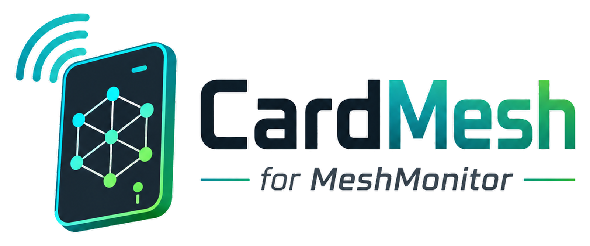
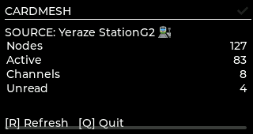
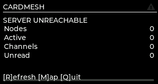

<p align="center">
  
</p>

<h1 align="center">CardMesh for MeshMonitor</h1>

<p align="center">
  <strong>Your pocket console for the mesh.</strong>
</p>

<p align="center">
  <a href="https://github.com/maxhayim/cardmeshformeshmonitor">
    
  </a>
</p>

**CardMesh** is a keyboard-first pocket client for **MeshMonitor**, designed specifically for the **M5Stack CardputerZero**.

It provides a compact physical interface for accessing MeshMonitor channels, direct messages, nodes, sources, telemetry, and eventually field/deployment tools without requiring a direct connection between the CardputerZero and a Meshtastic radio.

> **MeshMonitor does the heavy lifting. CardMesh puts the mesh in your hand.**

---

## Project Status

**Current status:** Early development / planning  
**Target initial release:** `v0.1.0`  
**Repository:** `maxhayim/cardmeshformeshmonitor`

This repository will remain **private during initial development and testing**.

Public release, licensing, contribution guidelines, and distribution plans will be determined once the application reaches a usable and stable state.

---

## Product Name

**Full Name:** CardMesh for MeshMonitor  
**Short Name:** CardMesh  
**Package Name:** `cardmesh`  
**Executable:** `cardmesh`  
**Target Platform:** M5Stack CardputerZero  
**Backend:** MeshMonitor REST API v1  

### Tagline

> **Your pocket console for the mesh.**

---

# Overview

CardMesh turns the CardputerZero into a dedicated portable console for MeshMonitor.

Instead of opening a phone, tablet, or laptop, a user should be able to pull out a CardputerZero and quickly:

- Read channel messages
- Send channel messages
- Read direct messages
- Send direct messages
- View unread message counts
- Browse mesh nodes
- Search nodes
- Inspect node details
- View RSSI and SNR
- View hop information
- View battery and telemetry
- Switch between MeshMonitor sources
- Perform traceroutes
- Monitor favorite nodes
- Eventually perform field and deployment testing

The intended experience is closer to a:

- radio control head
- pager
- BlackBerry
- field terminal

than a miniature desktop website.

---

# Architecture

CardMesh does **not** directly communicate with Meshtastic radios in the initial implementation.

Instead:

```text
Meshtastic / MeshCore / MQTT
           │
           ▼
      MeshMonitor
           │
    REST API v1 / HTTPS
           │
           ▼
       CardMesh
           │
           ▼
    CardputerZero
```

MeshMonitor remains responsible for:

- Radio connectivity
- Meshtastic connectivity
- MeshCore connectivity
- MQTT connectivity
- Message storage
- Node databases
- Telemetry
- Traceroutes
- Multiple sources
- Network history
- Server-side persistence

CardMesh acts as a lightweight remote client optimized specifically for the CardputerZero.

---

# Core Design Principle

CardMesh should not attempt to reproduce the entire MeshMonitor web interface.

If MeshMonitor already performs a function well, CardMesh should consume that function rather than recreate it.

CardMesh focuses on:

- Fast access
- Keyboard navigation
- Compact presentation
- Field use
- Messaging
- Node monitoring
- Multi-source access
- Low-distraction operation

---

# MeshMonitor API

CardMesh should use MeshMonitor's current source-scoped REST API.

Canonical API structure:

```text
/api/v1/sources/{sourceId}/...
```

Source discovery:

```http
GET /api/v1/sources
```

Examples:

```http
GET /api/v1/sources/{sourceId}/nodes
GET /api/v1/sources/{sourceId}/messages
GET /api/v1/sources/{sourceId}/channels
GET /api/v1/sources/{sourceId}/telemetry
GET /api/v1/sources/{sourceId}/traceroutes
GET /api/v1/sources/{sourceId}/network
GET /api/v1/sources/{sourceId}/packets
GET /api/v1/sources/{sourceId}/status
```

CardMesh should discover available sources rather than hard-code the source ID `default`.

---

# Authentication

MeshMonitor authentication should use an API token.

Requests should include:

```http
Authorization: Bearer <API_TOKEN>
```

Initial CardMesh setup should request:

```text
MeshMonitor Server
Port
HTTPS Enabled
API Token
Preferred Source
```

Example:

```text
Server:
mesh.example.com

Port:
443

HTTPS:
YES

API Token:
********************************
```

The application should provide a **Test Connection** function before saving the configuration.

---

# Recommended Technology Stack

The intended production stack is:

```text
C++17
LVGL
CMake
libcurl
nlohmann/json
SQLite3
Debian ARM64 packaging
CardputerZero AppBuilder
GitHub Actions
```

## Why C++ and LVGL?

Although CardputerZero runs Linux, CardMesh should behave more like a dedicated embedded application than a desktop program.

C++ and LVGL provide:

- Fast startup
- Low overhead
- Predictable rendering
- Responsive keyboard input
- Small memory footprint
- Minimal desktop dependencies
- Good control of the 320×170 display
- Alignment with the CardputerZero application ecosystem

A Python implementation may be useful for prototyping, but the intended production target is C++.

---

# Target Display

CardputerZero display:

```text
320 × 170
```

The interface should prioritize:

- Text
- Compact rows
- Clear hierarchy
- High contrast
- Minimal animation
- Readable fonts
- Keyboard shortcuts
- Fast navigation

Avoid:

- Oversized buttons
- Desktop-style menus
- Heavy graphics
- Complex maps
- Large animations
- Web layouts squeezed into the small screen

---

# Development, Emulator Testing, and Release Upload Workflow

CardMesh development should use the official CardputerZero web tools as part of the normal build/test/release cycle.

## Online Emulator

Primary browser-based emulator:

**https://cardputer.cc/emulator/**

The online emulator should be used throughout development to validate:

- Application startup
- 320×170 layout
- Keyboard-first navigation
- Screen transitions
- Text sizing and clipping
- Dialogs and error states
- Message composition UI
- Node and channel lists
- General usability before hardware testing

The emulator is an important development target, but it does **not** replace validation on a physical CardputerZero before a stable release.

Recommended loop:

```text
Implement Feature
      ↓
Build CardMesh
      ↓
Test in CardputerZero Emulator
      ↓
Fix UI / Input / Runtime Issues
      ↓
Test on Physical CardputerZero
      ↓
Package Release .deb
```

## CardputerZero Developer Center

Release packages will be uploaded through:

**https://dev.cardputer.cc/**

The CardputerZero Developer Center accepts Debian `.deb` application packages and is the intended submission path for CardMesh releases.

Expected release artifact:

```text
cardmesh_<version>_arm64.deb
```

Example:

```text
cardmesh_0.1.0_arm64.deb
```

The Developer Center uses GitHub authentication for package management and AppStore submission.

Because the CardMesh GitHub repository will remain **private during initial development**, early releases should be uploaded directly as `.deb` packages rather than depending on public-repository metadata integration.

Once the repository becomes public, AppStore metadata may also be sourced from the repository and `app-builder.json` where supported.

## Package Name

The intended Debian package name is:

```text
cardmesh
```

The package name should be treated as permanent once CardMesh begins publishing through the CardputerZero Developer Center.

Before the first production upload, verify all Debian metadata consistently uses:

```text
Package: cardmesh
Executable: cardmesh
Display Name: CardMesh
Architecture: arm64
```

## Screenshots

AppStore screenshots should be captured at the CardputerZero native resolution:

```text
320 × 170
```

The two below are the current Dashboard screen, host-rendered at 320×170 from
the real `DashboardScreen` code (`tools/screenshot/`) — not a mockup, but
also not a capture from real CardputerZero hardware or the online emulator.
See [`docs/DEVICE_BUILD.md`](docs/DEVICE_BUILD.md) for what that does and
doesn't confirm.

<p align="center">
  
  &nbsp;&nbsp;
  
</p>

Recommended screenshots for the first release:

1. Dashboard
2. Channels
3. Channel Chat
4. Nodes
5. Node Details
6. Sources

## Required Development Cycle

The intended CardMesh workflow is:

```text
GitHub Repository
maxhayim/cardmeshformeshmonitor
        ↓
Feature Branch
        ↓
Build + Automated Tests
        ↓
CardputerZero Online Emulator
cardputer.cc/emulator/
        ↓
Physical CardputerZero Testing
        ↓
Create ARM64 .deb
        ↓
GitHub Release / Release Candidate
        ↓
CardputerZero Developer Center
dev.cardputer.cc/
        ↓
AppStore Distribution
```

No stable CardMesh release should be considered complete until the release candidate has been tested in the emulator and, where available, on physical CardputerZero hardware.

---

# Suggested Project Structure

```text
cardmeshformeshmonitor/
│
├── .github/
│   ├── workflows/
│   │   ├── build.yml
│   │   ├── test.yml
│   │   └── release.yml
│   │
│   └── ISSUE_TEMPLATE/
│
├── src/
│   ├── main.cpp
│   │
│   ├── api/
│   │   ├── MeshMonitorClient.cpp
│   │   ├── MeshMonitorClient.h
│   │   ├── HttpClient.cpp
│   │   └── HttpClient.h
│   │
│   ├── models/
│   │   ├── Source.h
│   │   ├── Node.h
│   │   ├── Message.h
│   │   ├── Channel.h
│   │   ├── Telemetry.h
│   │   └── Traceroute.h
│   │
│   ├── storage/
│   │   ├── Database.cpp
│   │   ├── Database.h
│   │   ├── Settings.cpp
│   │   └── Settings.h
│   │
│   ├── sync/
│   │   ├── SyncManager.cpp
│   │   └── SyncManager.h
│   │
│   ├── input/
│   │   ├── Keyboard.cpp
│   │   └── Keyboard.h
│   │
│   └── ui/
│       ├── ScreenManager.cpp
│       ├── ScreenManager.h
│       ├── DashboardScreen.cpp
│       ├── SourcesScreen.cpp
│       ├── ChannelsScreen.cpp
│       ├── ChatScreen.cpp
│       ├── NodesScreen.cpp
│       ├── NodeDetailScreen.cpp
│       ├── DirectMessagesScreen.cpp
│       ├── TelemetryScreen.cpp
│       ├── FieldModeScreen.cpp
│       └── SettingsScreen.cpp
│
├── assets/
│   └── branding/
│       ├── logo.png
│       └── appicon.png
├── docs/
├── screenshots/
├── tests/
│
├── CMakeLists.txt
├── app-builder.json
├── .gitignore
├── README.md
└── CHANGELOG.md
```

---

# Application Layers

CardMesh should maintain clean separation between:

```text
UI
API
HTTP
Models
Storage
Configuration
Input
Synchronization
```

The UI should never perform raw HTTP requests directly.

Raw MeshMonitor JSON should not be parsed inside UI screens.

---

# MeshMonitor Client

The application should expose a dedicated API client.

Conceptually:

```cpp
meshMonitor.getSources();
meshMonitor.getNodes(sourceId);
meshMonitor.getChannels(sourceId);
meshMonitor.getMessages(sourceId);
meshMonitor.sendMessage(...);
meshMonitor.getTelemetry(...);
meshMonitor.requestTraceroute(...);
```

This abstraction should isolate the rest of CardMesh from changes in MeshMonitor's raw API structure.

---

# Local Storage

MeshMonitor remains authoritative for mesh data.

SQLite should only store CardMesh-specific state and cache information.

Recommended database:

```text
cardmesh.db
```

Possible tables:

```text
settings
read_state
favorites
recent_nodes
cached_sources
cached_nodes
cached_channels
cached_messages
field_sessions
field_measurements
```

---

# Configuration

Recommended path:

```text
~/.config/cardmesh/config.json
```

Recommended permissions:

```text
0600
```

Example:

```json
{
  "server": "mesh.example.com",
  "port": 443,
  "https": true,
  "token": "TOKEN",
  "preferredSource": "default"
}
```

Real credentials must never be committed to this repository.

---

# Security

CardMesh may handle private mesh conversations and API credentials.

Requirements:

- HTTPS support
- TLS certificate verification enabled
- API tokens never logged
- API tokens never committed
- Obscured token entry
- Restricted configuration permissions
- No analytics
- No advertising
- No developer-operated proxy
- No external application telemetry
- Direct communication with the user's configured MeshMonitor instance

---

# First Launch

Proposed setup screen:

```text
CARDMESH
for MeshMonitor

MeshMonitor Server
________________________

Port
443

HTTPS                  [X]

API Token
************************

[T] Test Connection

ENTER Save
ESC Cancel
```

Successful connection:

```text
✓ CONNECTED

MeshMonitor found
5 sources available

ENTER Continue
```

---

# Dashboard

Example:

```text
┌──────────────────────────────┐
│ CARDMESH                 ●   │
├──────────────────────────────┤
│ SOURCE: Doral                │
│                              │
│ Nodes                  127   │
│ Active                  83   │
│ Channels                 8   │
│ Unread                   4   │
│                              │
│ [M] Messages                 │
│ [N] Nodes                    │
│ [D] Direct                   │
│ [S] Sources                  │
└──────────────────────────────┘
```

Connection indicators:

```text
● Connected
○ Disconnected
↻ Connecting
! Error
```

---

# Sources

Multi-source support should be implemented from the beginning.

Example:

```text
SOURCES

> Doral Base          ●
  EOC                 ●
  Brickell            ●
  Lake Placid         ○
  MQTT Florida        ●

ENTER Select
R Refresh
ESC Back
```

CardMesh should remember the preferred source between launches.

---

# Channels

Example:

```text
CHANNELS

> Primary              2
  FloridaMesh           4
  SDGMRS                0
  LongFast              0
  Testing               1

↑↓ Select
ENTER Open
R Refresh
```

The number on the right represents the local unread count.

---

# Channel Chat

Example:

```text
FloridaMesh
──────────────────────────────

K4ABC 22:41
Testing Kendall node.

MTEDC 22:43
Copy from Doral.

WRUV246 22:44
Testing CardMesh.

──────────────────────────────
> Message_

ENTER Send
ESC Back
```

Message states may include:

```text
QUEUED
SENDING
SENT
ACK
FAILED
```

CardMesh should never display a message as acknowledged or delivered unless the available MeshMonitor data supports that state.

---

# Nodes

Example:

```text
NODES                     83

> MTEDC II          0h   NOW
  SDGMRS EOC        0h    2m
  Brickell          1h    4m
  Kendall Solar     2h   38m
  GAT562 MAX        0h   NOW

/ Search
F Favorite
ENTER Details
```

Potential sort options:

```text
Last Heard
Name
Hop Count
RSSI
SNR
Favorite
```

---

# Node Search

Press:

```text
/
```

Example:

```text
SEARCH NODES

> MTED

MTEDC I
MTEDC II
MTEDC Solar

ENTER Open
ESC Cancel
```

Search should operate against the locally cached node list rather than making an HTTP request for every keystroke.

---

# Node Details

Example:

```text
MTEDC II
──────────────────────────────

ID       !a13f829c
Status   ONLINE
Last     18 sec
Hops     DIRECT
RSSI     -87 dBm
SNR      +6.25 dB
Battery  92%
Voltage  4.12 V

[M] Message
[T] Telemetry
[R] Route
[F] Favorite
```

Unknown information should display:

```text
--
```

Never fabricate unavailable values.

---

# Direct Messages

Example:

```text
DIRECT MESSAGES

> SDGMRS EOC             3
  K4ABC                  1
  Brickell               0
  MTEDC II               0

ENTER Open
N New
ESC Back
```

---

# Unread Tracking

Unread state may initially be stored locally.

Store:

```text
source_id
conversation_type
conversation_id
last_read_timestamp
```

Conversation types:

```text
CHANNEL
DM
```

Basic logic:

```text
message.timestamp > last_read_timestamp
```

This avoids requiring any modification to MeshMonitor itself.

---

# Refresh Strategy

Initial implementation can use polling.

Suggested defaults:

```text
Dashboard:    10 seconds
Active Chat:   3–5 seconds
Nodes:        10 seconds
Telemetry:    15–30 seconds
Background:   30 seconds
```

Incremental retrieval should be used whenever supported by MeshMonitor.

Avoid repeatedly downloading complete message history.

---

# Offline Behavior

CardMesh should not crash when MeshMonitor becomes unreachable.

Example:

```text
OFFLINE
Last sync 2m ago
```

Cached information should remain visible.

Users should still be able to browse:

- Nodes
- Channels
- Previous messages
- Favorites

Sending should initially be disabled while offline.

```text
CANNOT SEND
MeshMonitor offline.
```

Offline message queueing is not part of the MVP.

---

# Keyboard Controls

CardMesh should be highly keyboard-driven.

Possible global shortcuts:

```text
M    Messages
N    Nodes
D    Direct Messages
S    Sources
H    Home
/    Search
R    Refresh
ESC  Back
```

Node details:

```text
M    Message
T    Telemetry
R    Traceroute
F    Favorite
```

Keyboard shortcuts must be disabled or adjusted appropriately while the user is typing into a text field.

---

# Error Handling

Avoid generic errors such as:

```text
ERROR 7
```

Prefer descriptive messages.

Examples:

```text
SERVER UNREACHABLE
Check Wi-Fi or server address.
```

```text
AUTH FAILED
API token rejected.
```

```text
SOURCE UNAVAILABLE
Selected MeshMonitor source is offline.
```

```text
MESSAGE FAILED
MeshMonitor rejected transmission.
```

---

# Background Architecture

Recommended logical structure:

```text
UI THREAD
    │
    ├── LVGL rendering
    └── Keyboard input

NETWORK WORKER
    │
    ├── HTTP requests
    └── JSON parsing

SYNC MANAGER
    │
    ├── Messages
    ├── Nodes
    ├── Sources
    └── Telemetry

DATABASE
    │
    └── SQLite
```

Blocking HTTP calls should never execute directly inside the UI event loop.

---

# Performance Goals

Initial targets:

```text
Cold launch:        < 3 seconds where practical
Menu response:      < 100 ms
Keyboard response:  Immediate
Network requests:   Non-blocking UI
Idle CPU usage:     Low
Memory usage:       Comfortably within device limits
```

---

# MVP — v0.1.0

The first usable version should include:

- First-run setup
- MeshMonitor server configuration
- API token authentication
- HTTPS
- Connection testing
- Source discovery
- Source selection
- Dashboard
- Channels
- Channel messages
- Sending channel messages
- Node list
- Node search
- Node details
- Direct messages
- Sending direct messages
- Local unread tracking
- Settings
- Basic local cache
- Network error handling
- Automatic reconnect

---

# MVP Acceptance Criteria

The MVP is successful when a user can:

1. Install CardMesh.
2. Open CardMesh.
3. Configure a MeshMonitor server.
4. Enter an API token.
5. Test the connection.
6. Discover MeshMonitor sources.
7. Select a source.
8. Browse channels.
9. Read channel messages.
10. Send a channel message.
11. Browse nodes.
12. Search nodes.
13. Inspect node information.
14. Browse direct conversations.
15. Send a direct message.
16. See unread indicators.
17. Restart without losing configuration.
18. Lose network connectivity without crashing.
19. Reconnect without restarting CardMesh.
20. Run correctly in the CardputerZero online emulator.
21. Render correctly at 320×170 without clipped critical controls or text.
22. Produce a valid ARM64 `.deb` package suitable for upload to the CardputerZero Developer Center.

---

# MVP Non-Goals

Do not initially implement:

- Direct BLE Meshtastic communication
- Direct USB Meshtastic communication
- Serial Meshtastic communication
- Meshtastic protobuf stack
- Firmware flashing
- Radio configuration
- Full maps
- GPS navigation
- VPN functionality
- MeshMonitor administration
- Complex historical charts
- Multi-server aggregation
- Full field testing

The core remote-client experience should be stable before advanced functions are added.

---

# Roadmap

## v0.1 — Core Client

- Setup
- Authentication
- Source discovery
- Channels
- Messages
- Nodes
- Direct messages
- Unread state
- Local cache

## v0.2 — Monitoring

- Telemetry
- Favorites
- Node filtering
- Packet information
- Delivery state improvements
- Better unread management

## v0.3 — Radio Tools

- Traceroute
- Canned messages
- Favorite-node dashboard
- Node alerts
- Source alerts

## v0.4 — Field Mode

- Deployment sessions
- RSSI/SNR recording
- Hop monitoring
- Direct-vs-relayed statistics
- Local field reports
- Antenna comparison tools

## v1.0 — Stable Release

- Reliable daily operation
- Mature reconnect handling
- Robust caching
- Stable API abstraction
- Complete keyboard navigation
- CardputerZero packaging
- Documentation
- Release automation
- Stable upgrade process

---

# Future: Telemetry

Example:

```text
MTEDC II TELEMETRY

Battery
92%

Voltage
4.12 V

Temperature
34.2 C

Updated
18 sec ago
```

Historical data should initially favor compact statistics over graphs.

Example:

```text
BATTERY 24H

Now      92%
Low      73%
High     100%
```

---

# Future: Traceroute

Example:

```text
TRACEROUTE

Target:
SDGMRS EOC

REQUESTING...

────────────

YOU
 │
 ▼
MTEDC II
 │
 ▼
SDGMRS EOC

2 HOPS
```

---

# Future: Field Mode

Field Mode is intended to become one of CardMesh's primary CardputerZero-specific features.

Use cases:

- Node deployment
- Antenna testing
- Site testing
- Link validation
- Field diagnostics

Example:

```text
FIELD TEST
SDGMRS EOC

Last Heard       2 sec
RSSI             -83
SNR              +7.5
Hops             DIRECT

Packets          28
Direct           26
Relayed           2

[F1] Start
[F2] Route
[F3] Mark
[F4] Save
```

---

# Future: Field Sessions

Possible session data:

```text
session_id
start_time
end_time
selected_source
target_node
notes
```

Measurement data:

```text
timestamp
node_id
rssi
snr
hop_count
last_heard
battery
voltage
latitude
longitude
```

---

# Future: Antenna Comparison

Example:

```text
ANTENNA TEST

5.8 dBi Omni
Packets      100
Direct        73%
RSSI Avg     -96
SNR Avg      +2.1

Yagi
Packets      100
Direct        96%
RSSI Avg     -81
SNR Avg      +7.8

IMPROVEMENT
RSSI         +15 dB
```

---

# Future: Favorites

Example:

```text
★ SDGMRS EOC
★ MTEDC II
★ Brickell
```

Favorites may eventually appear directly on the dashboard.

---

# Future: Alerts

Potential alerts:

```text
Favorite node online
Favorite node offline
Low battery
New direct message
Unread channel message
Source disconnected
```

---

# Future: Canned Messages

Example:

```text
1 Testing.
2 Copy.
3 Node online.
4 Testing antenna.
5 Please acknowledge.
6 Deployment complete.
```

Potential shortcuts:

```text
ALT+1
ALT+2
ALT+3
```

---

# MeshMonitor Virtual Node

MeshMonitor also provides a Virtual Node TCP interface.

CardMesh should **not** use Virtual Node for the initial implementation.

The REST API is preferred because it provides:

- Authentication
- Source discovery
- Historical data
- Node information
- Telemetry
- Multi-source support
- MeshMonitor-specific metadata
- Simpler client state management

Virtual Node may be explored later if a full Meshtastic-compatible protocol connection becomes useful.

---

# Reference Concept

CardMesh is conceptually similar to **MeshMonitor Chat for iOS by Andros**, which demonstrates the usefulness of an independent client communicating with MeshMonitor instead of directly with a radio.

The architectural concept is:

```text
Client
   │
REST API
   │
MeshMonitor
   │
Mesh Radio
```

CardMesh should independently implement this architecture specifically for CardputerZero.

---

# GitHub Development Workflow

Canonical repository:

```text
maxhayim/cardmeshformeshmonitor
```

Recommended workflow:

```text
Issue / Idea
     ↓
Feature Branch
     ↓
Implementation
     ↓
Testing
     ↓
Pull Request
     ↓
Review
     ↓
Merge
     ↓
Release
```

Example feature branches:

```text
feature/api-client
feature/setup-screen
feature/source-browser
feature/node-browser
feature/chat
feature/direct-messages
feature/unread-state
feature/telemetry
feature/field-mode
```

---

# GitHub Actions

Future CI should perform:

```text
Push / Pull Request
        ↓
Configure
        ↓
Compile
        ↓
Run Tests
        ↓
Cross-compile ARM64
        ↓
Produce Testable .deb
```

Development and release candidates should then be validated using:

```text
Build Artifact
      ↓
CardputerZero Online Emulator
https://cardputer.cc/emulator/
      ↓
Physical CardputerZero
```

Tagged releases should eventually perform:

```text
Git Tag
   ↓
Build ARM64 package
   ↓
Create SHA256
   ↓
Create GitHub Release
   ↓
Attach .deb
   ↓
Upload approved .deb to
https://dev.cardputer.cc/
```

Example:

```text
v0.1.0
```

Artifact:

```text
cardmesh_0.1.0_arm64.deb
```

The Developer Center upload should remain a deliberate release step after validation rather than automatically publishing every CI build.

---

# Testing

Unit tests should cover:

- API URL construction
- Source parsing
- Node parsing
- Channel parsing
- Message parsing
- Timestamp parsing
- Configuration loading
- Configuration validation
- Unread calculation

Integration testing should include:

```text
200 OK
400 Bad Request
401 Unauthorized
403 Forbidden
404 Not Found
429 Too Many Requests
500 Server Error
Timeout
Connection refused
Invalid JSON
Empty result
Missing optional fields
```

---

# Mock Development Mode

A mock API mode would allow UI development without requiring a live MeshMonitor server.

Example:

```text
CARDMESH_MOCK=1
```

Suggested mock data:

```text
5 Sources
100 Nodes
8 Channels
300 Messages
10 Direct Conversations
Telemetry
Online Nodes
Offline Nodes
Missing RSSI
Missing SNR
Missing Battery Data
```

---

# Logging

Recommended log location:

```text
~/.local/state/cardmesh/cardmesh.log
```

Levels:

```text
ERROR
WARN
INFO
DEBUG
```

Never log:

```text
API Tokens
Passwords
Private Credentials
Channel Keys
```

---

# `.gitignore`

At minimum:

```gitignore
build/
dist/
*.deb
*.log

.env
.env.*
*.token

config.json
credentials.*

cardmesh.db
```

Real MeshMonitor credentials and private configuration must never be committed.

---

# Development Order

## Phase 1 — Application Skeleton

- CardputerZero build environment
- CMake
- LVGL
- Keyboard input
- Navigation
- Placeholder screens

## Phase 2 — HTTP and API

- `HttpClient`
- `MeshMonitorClient`
- HTTPS
- Bearer authentication
- Errors
- Timeouts

## Phase 3 — Setup

- Server
- Port
- HTTPS
- Token
- Test connection
- Persistence

## Phase 4 — Sources

- Retrieve sources
- Select source
- Remember source

## Phase 5 — Nodes

- Retrieve nodes
- Node list
- Search
- Details

## Phase 6 — Channels

- Retrieve channels
- Display channels

## Phase 7 — Messaging

- Retrieve messages
- Render conversations
- Compose messages
- Send messages

## Phase 8 — Direct Messages

- Conversation list
- New DM
- Send DM

## Phase 9 — Persistence

- SQLite
- Cache
- Unread state
- Favorites framework

## Phase 10 — Hardening

- Reconnect
- Authentication failures
- Network failures
- Malformed responses
- Empty states
- API compatibility

## Phase 11 — CI, Emulator Testing, and Packaging

- GitHub Actions
- Automated tests
- ARM64 build
- Generate `.deb`
- Test release candidate in `https://cardputer.cc/emulator/`
- Test on physical CardputerZero where available
- Create GitHub release artifact
- Upload approved release `.deb` through `https://dev.cardputer.cc/`

---

# Notes for AI Coding Assistants

When using Claude, ChatGPT, Codex, or another coding assistant on this repository:

1. Inspect the repository before modifying it.
2. Treat this README and current repository structure as the working specification.
3. Verify current MeshMonitor API behavior before assuming endpoint response formats.
4. Verify current CardputerZero development requirements.
5. Keep networking outside the UI layer.
6. Keep MeshMonitor API logic behind `MeshMonitorClient`.
7. Keep raw HTTP inside `HttpClient`.
8. Do not parse API JSON inside UI screens.
9. Keep the UI responsive during network operations.
10. Optimize specifically for the 320×170 display.
11. Assume physical keyboard operation.
12. Do not commit credentials.
13. Keep the project buildable after major changes.
14. Add tests for API parsing and state logic.
15. Do not implement direct Meshtastic radio support unless the project architecture is intentionally changed.
16. Treat `https://cardputer.cc/emulator/` as the primary browser-based CardputerZero UI/runtime test environment.
17. Validate release candidates in the online emulator before packaging them as stable releases.
18. Build release packages as ARM64 Debian `.deb` files.
19. Use `https://dev.cardputer.cc/` as the CardputerZero release-upload and AppStore submission portal.
20. While the GitHub repository is private, do not assume the Developer Center can import repository metadata; direct `.deb` upload is the initial distribution workflow.

---

# Initial Development Objective

The first major milestone is:

> Build a working CardputerZero application that authenticates with MeshMonitor, discovers sources, allows source selection, displays channels, messages and nodes, and reliably sends both channel and direct messages.

Advanced field tools should not be developed until this core functionality is reliable.

---

# Final Product Definition

**CardMesh for MeshMonitor** is a fast, keyboard-first pocket client and field console for MeshMonitor built specifically for the M5Stack CardputerZero.

Core architecture:

```text
CardMesh
   │
HTTPS REST API
   │
MeshMonitor
   │
Meshtastic / MeshCore / MQTT
```

Development repository:

```text
maxhayim/cardmeshformeshmonitor
```

Package:

```text
cardmesh
```

Future release artifact:

```text
cardmesh_<version>_arm64.deb
```

### Core Philosophy

> **MeshMonitor does the heavy lifting. CardMesh puts the mesh in your hand.**

## License

This project is licensed under the MIT License.

See the [LICENSE](LICENSE) file for details.  
Full license text: https://opensource.org/licenses/MIT

---

## Contributing

Pull requests are welcome. Open an issue first to discuss ideas or report bugs.</p>

---

## Acknowledgments

* MeshMonitor built by [Yeraze](https://github.com/Yeraze) 

Discover other Community Add-ons for MeshMonitor: https://meshmonitor.org/add-ons/
